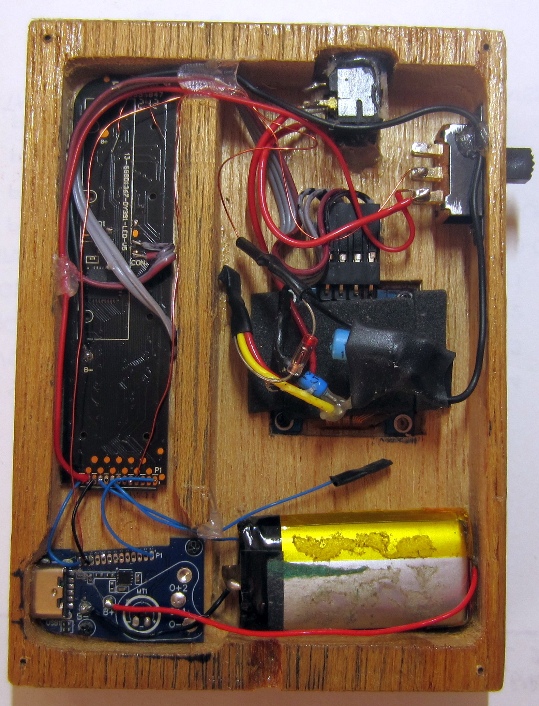
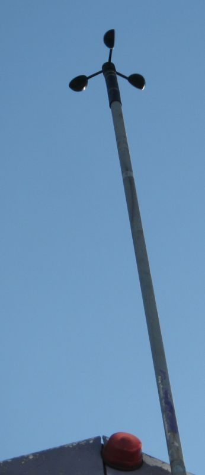

# PY32Duino-Anemometer

Turning a disposable vape into an anemometer using the NASTY BAR 20000 puffs from NASTY Juice CO in Malaysia.

So far Ive only come across 2 vapes that use the PY32F030EK28 mcu, the Nasty Bar 20000 and the BLVK Bar 20000.

These are the 2 vapes containing the F030EK28 mcu.
Standard batt is a li-ion 14500 800mah which I upgraded to a flatter style with 900mah.

The finished meter up on the wall

A view of the internals.

The 3D printed cups stl came from https://www.thingiverse.com/thing:2559929/files
After 3 years, the magnet had rusted and was replaced.

